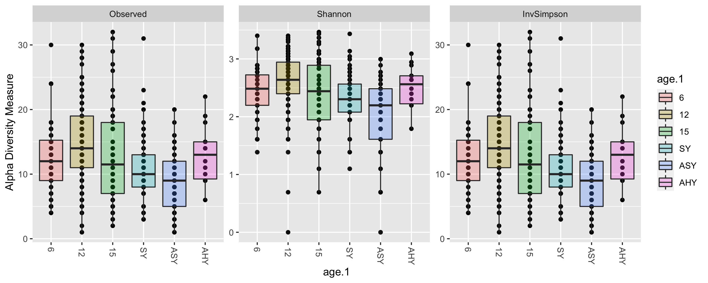
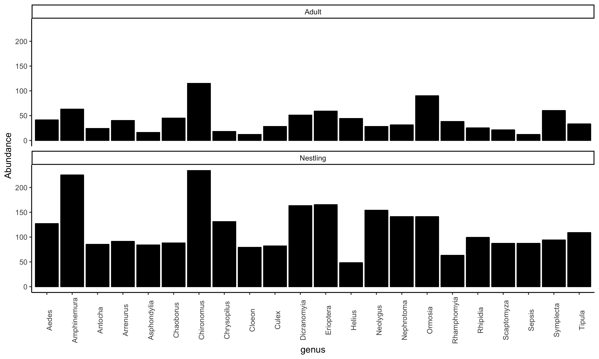
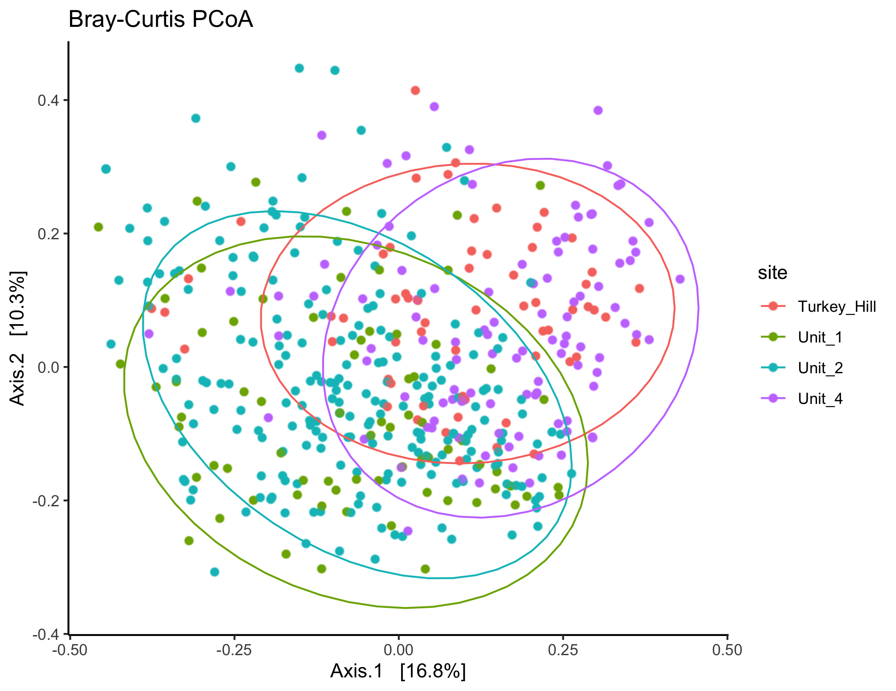
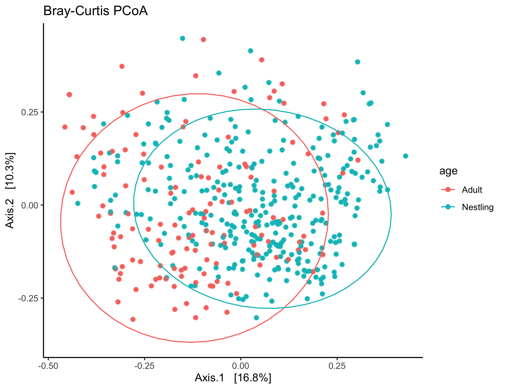
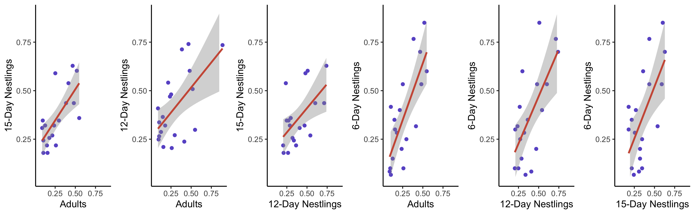
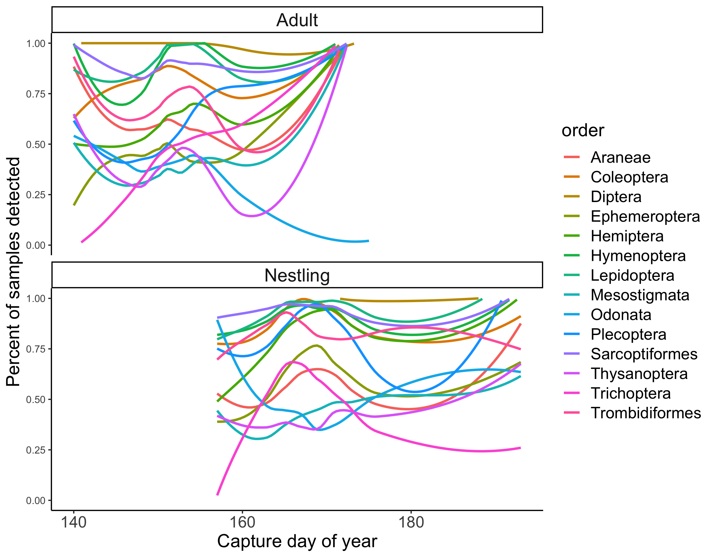
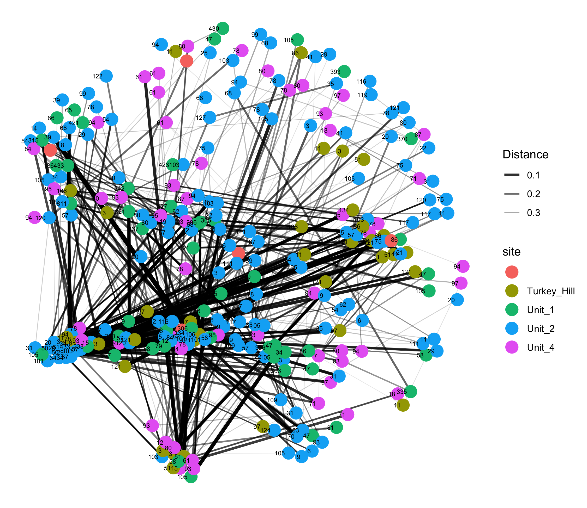
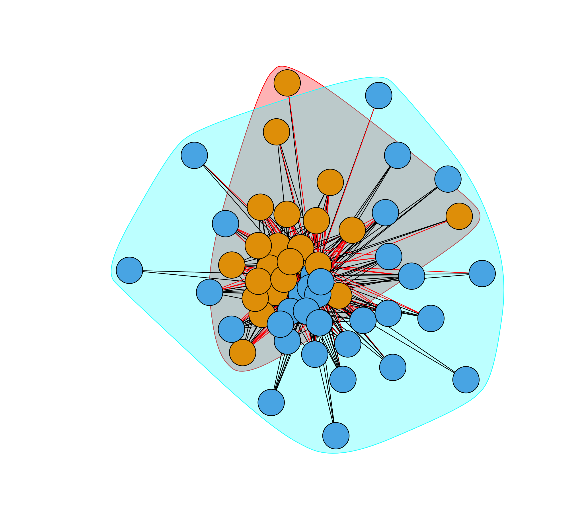

```{r setup, include=FALSE}
knitr::opts_chunk$set(echo = TRUE)
library(knitr)
library(dplyr)
library(ggplot2)
library(here)
library(sjPlot)
```

# Overview

  This is a summary document for processing and working with COI data from tree swallow nestlings and adults using fecal samples collected in the field. The wetlab procedures are not described here. A lot of this is data cleaning and checking with a few basic plots and analyses at the end. The figures produced here are pasted in from the separate R script, to find the actual code to produce the analyses check that main script in this same repository.
  
# AMPtk Pipeline

  All of the raw sequences for these samples were processed using the `AMPtk` pipeline in the command line [@amptk]. We followed very closely the workflow described on the project website `amptk.readthedocs.io/en/latest`. Before running `AMPtk` you need to install the software in a conda environment, install `USEARCH` and download the COI database. Those steps are kind of a pain, but they are described in detail on the website and not repeated here. 

A few notes to avoid headaches repeating this later: 
 
- It seems that currently there is no way to run AMPtk on Mac with OS Catalina because it can't execute the 32bit `USEARCH` program. Use an older computer, virtual machine, or cloud computing.
- The pipeline expects your sequences to be named: `sampleID_whatever_filler_R1/F1.fastq.gz`. The BRC sequences come back with the sample name in the middle. I haven't yet figured out how to make `AMPtk` recognize that, so I've just been batch-renaming the files to get the sample name first.
 
 Once `AMPtk` is installed. The entire pipeline that I've run to this point involves just three commands (will take several hours on a home laptop to run with samples in hundreds). Output files will be saved in the folder where you have set up your conda environment.
 
1. Pre-processing sequence data. Takes a set prefix to add to all files and the forward and reverse primer sequences. Specify input folder where sequences are stored.

> `amptk illumina -i /directory/with/sequences -o trescoi` 
> `-f GCHCCHGAYATRGCHTTYCC -r TCDGGRTGNCCRAARAAYCA`

2. Denoising with `DADA2` [@dada2]. This takes in the processed sequences from step one and applies the denoising algorithm that identifies ASVs and models sequencing error to arrive at a final list of ASVs for F/R reads. Forward and reverse reads are then merged together.

> `amptk dada2 -i tres.coi.demux.fg.gz --platform illumina -o trescoi`
 
3. Assigning taxonomy. This uses the default suggestions from `AMPtk` documentation, but there are many other options. It applies the 'hybrid taxonomy algorithm', which looks at matches to i) Global Alignment to the downloaded COI arthropod database, ii) UTAX classification, and iii) SINTAX classification. More info is on the website, but basically it retains the best hit that also has the most levels of taxonomic ranks. The arthropod COI database needs to be downloaded and set up for this to run.

> `amptk taxonomy -i trescoi.cluster.otu_table.txt -f trescoi.cluster.otus.fa -d COI`

Those three commands produce a bunch of output files, but only three are needed to pull into `R` for subsequent analyses. 

- **trescoi.cluster.otu_table.txt** has samples in columns and OTUs in rows with reads in each cell
- **trescoi.cluster.taxonomy.txt** has full taxonomic information for each OTU
- **trescoi.mapping_file.txt** has one row for each sample to add metadata

Those three files are read into the `R` script in this repository as the basis of everything here with the addition of sample metadata. The additional `AMPtk` files are saved in a folder with the repository but are not used further. 

**NOTE:** There are many other optional steps in `AMPtk`. For example, one set of commands works to try to remove barcode bleed over where sequences from one barcode/sample are accidentally attributed to other samples. There are different types of classifiers and options, etc. What I've done here is (I think) kind of the basic or bare-bones pipeline.

# Moving to R

  The first part of the main script deals with importing those three `AMPtk` files and merging them into a single `phyloseq` object [@phyloseq]. There is a fair amount of wrangling that happens in the script, but it's really all just reformatting and merging things together into the format that `phyloseq` expects. It isn't necessary to use `phyloseq` for a lot of these things, but once the data is merged into that object it is very easy to work with all of their functions for subsetting, filtering, merging, plotting etc. The one thing that is not in here at the moment is a phylogenetic tree for the relationships between the food items. `phyloseq` will accept a tree also and that would allow for things like calculating unifrac & Faith's phylogenetic diversity or plotting diets on trees etc. We could add that later if desired. I have code in our microbiome processing scripts that builds a tree from the gene sequences but we would have to adapt it from there. There may also be something in `AMPtk` that would do this for us.
  
# Sequencing Depth

  One of the first things worth checking is how many sequences we have per sample. This is showing the number of sequences retained for each sample *after* merging, denoising, whatever other filtering dada2 did, and removing everything except for Arthropods. So many of these samples did have quite a few more reads in the initial return. There are two reasons to look at the read counts. First, to see if samples 'worked' for getting data. Most of what we've heard from other people using these techniques is that they expect 5-15% of their samples to just fail to return reads for some reason (no dna, bad extraction, bad amplification, not enough sample added to sequencer, etc). We have been really loading our MiSeq runs with the max samples and they are trying to pool all 384 at even DNA concentrations, so I think it's not surprising that a fair number would fall out. The second reason to look at this is to decide if we might want to rarefy samples to an even depth of reads for some analyses. This could be especially important for comparing alpha diversity metrics where more samples might = more diversity (I say might because it isn't clear to me that it will keep increasing the way it would with microbiome where you may not get complete sampling of the community). Anyway, here is the log total number of reads per sample for all samples combine (log scale makes it easier to see the variation on the low end, which is what we care about). 
  
\  
  
I added in a reference line showing where 150 reads would fall. That is a pretty low number to rarefy to, but even there we lose a bunch of samples that are very low. It's probably worth some extra investigation into what the effect of rarefying to 150 is. It might be that in many of those samples all 150 reads are from the same single food item and in some of the higher read samples you still recover the full (or mostly full) community even with only 150 samples. One thing with this plot is that it does include negative controls and nestlings. Here is the same plot with them broken out.

\

This does help some. It looks like all but one negative control has very low reads. One thing that we may need to think about is that even though these negative controls have low reads overall, they *do* have some reads that hit on arthropod and other sequences. I'm not sure if that means that there was some cross contamination in the lab procedure, or if this is a result of the index-bleed that I mentioned above. We could try to get the `AMPtk` function running for index bleed or alternatively, we could try doing something like only counting a prey item as encountered if there are more than 50 (?) reads for that taxa within a sample. Eliot & Dave are currently using 50 reads as a cuttoff for their warbler diet data. Just as a quick check I looked at pruning to a certain number of reads for the negative control samples. If you only include taxa with >25 reads there are only 3 genera retained across all the negative controls, that might be a reasonable criteria.

For now I'm not doing any rarefying, just to move on, but this probably still needs some consideration for a final decision or--more likely--some sensitivity analysis using different thresholds to make sure there isn't a huge effect on interpretations.


# Filtering in Phyloseq 

The next steps in the R script are doing a bunch of possible filtering steps using `phyloseq`. There are kind of a lot of choices here and a bewildering variety of different combinations of options that are all plausible. Probably it will make sense to do some analyses that include different sets of these options. Basically, these are the considerations to think about. The example code to do each of these actions is in the R script and there are also really good `phyloseq` vignettes online that demonstrate all of these steps.

- **Agglomerate Taxa**: Many ASVs don't have full species level identification. We can group together at the genus/family/order level to include those samples, or just to make it easier to interpret differences with fewer taxa. There is an easy function to do this so it's really a choice to be made.
- **Remove x-tons**: Removing singletons is very common. Some kind of sensitivity analysis removing 1-tons, 5-tons, 25-tons, etc might be good. See issue described above for negative controls.
- **Transform to Relative Abundance**: For some analyses we'll want relative abundance rather than raw reads. The function is in the script. This should be done after rarefaction if using even depths.
- **Filter out rare taxa**: It's easy to do things like remove taxa <x% of all reads or <x% of reads within each sample or that appear in <x% of all samples. There are a few reasons to do this. First, it might be helpful for issues discussed above relating to clean up that could be sequencing mistakes, etc. Second, for looking at differential allocation of diet (e.g., to adults vs. nestlings) there is no power to detect differences for diet items that are very rare, so it may be better use of statistical power to focus just on common diet items for those analyses (e.g., genera that are found in >10 or >20% of all fecal samples, etc).
- **Filtering samples by attribute**: There is an easy subsetting function by sample metadata. For different analyses might want to do things like take out or only look at negative controls. Or just adults or nestlings, etc.
- **Transform to Presence Absence**: Change relative abundance to 1/0 for each taxa. More reliable (probably) than relative abundance. I still think it is worth looking at some things both ways, but this may be the more conservative (or at least less controversial) way to present. Should be done after any filtering and rarefying above.

I've put in *one* set of possible transformation and filtering steps to the current script, but of course there are many different choices that could be made here either for different questions or with different justifications...

# Make some plots

OK, so assuming we've gone through all the decision steps above, this is really the point to start thinking about actual analysis options for real biology questions. I'm making example plots for a couple of easy to look at quick things here mainly just to give examples of the plotting functions. Of course other things are possible too and these are just exploratory.

#### Alpha diversity by age

\

#### Taxa observed diversity by age and site

\

#### Barplot of all genera
Too many here to label, but I think it's cool to see that there is SO much diversity in genera and there are actually still quite a lot of genera that are found in 10/20/30% of all samples (red lines). 

\

#### Common Genera
This is just genera that are in >20% of all samples split out by adults and nestlings. The y axis is number of samples present so the scales aren't exactly comparable (should change to percent of sampels...need to figure out code for that).

\

#### Ordinate Site
This style of ordination plot could be useful for comparing the overall diets between any group of categorical variables. There are unfortunately also a lot of choices here too. Which filtered `phyloseq` object to use? Which method to use for ordination (MDS, PCoA, NMDS, DPCoA, etc)? Which distance metric to use (Bray, Jaccard, Unifrac, UMAP, etc?) This is DPCoA with Bray-Curtis distances...just for a start.

\

It sure looks like there are site difference here in overall diet. You could test for significant differences in the location of the multivariate centroid and degree of dispersion here by running PERMANOVAs using the `adonis2` and `permdisp` functions from the `vegan` package [@vegan]. These would obviously be significantly different.

#### Ordinate Age
Same as above but for age.

\

There is also separation here. One thing that you notice here is that a lot of those 4/TH samples are nestlings whereas 1/2 has more adults in this dataset, so it's hard to split out the site vs. age difference from these plots.

#### Ordinate Site within Age

To check whether there really is a site difference, I'm now splitting each age into a separate panel.

\

Cool! There really does seem to be a site difference and it is apparent in both the adults and nestlings. The colors don't match up here but those can all be set manually to match between figures with a little editing of the ggplot calls.

#### Ordinate Age within Site

Just for fun, here is the reverse faceting.

\

Really cool! There also seems to be a consistent adult vs. nestling difference that is apparent across all four sites, but it less apparent when you merge all four sites together. Again this could all be tested, but it looks like a pretty clear difference to me! This is also including some 12 & 15 day olds as 'nestlings' and some males/females and different ages etc in the adult group, so it could be broken down more.

#### Adult vs. Nestling Diets
  
  Now I'm plotting the frequency that different items appear in adult vs. nestling diets. This could be done in several different ways. Here I'm using only genera that are in >20% of all samples and I'm plotting a percentage of fecal samples for each group that had the item in them (i.e., presence/absence not relative abundance). I'll calculate separately for adults and 12 vs. 15 day old nestlings then plot them as scatterplots to look for correspondence. Points with large residuals are over/under-represented in one groups diet. Really this should be formally tested with some of the tools like `DESeq2` that will look for significant difference in logfold changes between the groups. 
  
\

Overall there seems to be a reasonably high correspondence between the samples from different ages, but it's interesting that adults vs. day 12 nestlings seems to be the most dissimilar. Looking at that middle panel, that one point that is much more common for nestlings is a genus of stoneflies (aquatic!) and the one that is more common for adults is a genus of crane flies (mostly terrestrial?). There are of course other ways this could be broken up too; I'm combining all the sites but based on the ordination plots above maybe these comparisons should be made within each site. It'll be really interesting to add in the younger age nestlings from 2020 to this where maybe the biggest difference could be expected. It seems like it would also be really useful to put rough size classes onto these genera or families. Ryan & Lily had that just at order level right? Maybe if it is filtered down to just the most common genera like this it wouldn't be such a daunting task to figure out some more features of each of them. 

#### Date by Age

This could be a cool way to compare with the figures in Ryan & Lily's Ecology Letters paper on seasonal availability of different insects. I'm plotting here at the order level with smoothed lines and each sample as 1/0 for detection. Of course we could also do this with relative abundance or finer taxonomic levels, etc. Note that these are just loess smooths, so some of the wiggliness may be in areas with little data rather than real patterns. I removed the confidence intervals because it is impossible to see anything, but they are quite large around most of these lines especially early and late in the season. It's crazy how they ALWAYS have diptera!

\

#### Date by Site

Same thing but for each site. I did also try splitting this out by age within site. We have very different sampling blocks of time at the different sites. I think a lot of these will be filled in much more after getting the next two sequencing runs, so I'm just leaving it like this for now.

\

#### Plotting Networks

Just as an example, there is also some potential to use network plotting and network metrics to describe the similarity of different samples and see how they cluster together. There are many options here. Just one example showing a network based on Bray-Curtis distance and coloring by site. Labels are showing box numbers.

\

#### Just for fun

We've never really talked about this, but I was thinking it would be interesting to try to build a network of connections among the prey items that were detected in the same fecal samples. Maybe it would tell us something about the habitat that the bird was foraging in for that trip? Or maybe there wouldn't be any pattern. Anyway, I'm just playing around with it here to see if there is any obvious structure. There are plotting tools to make network plots based on dissimilarity within `phyloseq` that run off of `igraph`, but I think what I'm trying to do is different from those? Like above, this could be done differently for different sites or ages or subsets, etc. I'm just doing it here for all samples together for simplicity.

\

Well, that seemed like a cool idea but there doesn't seem to be much obvious going on in terms of food being found together in the same fecal sample. Not sure it is a total bust as there are probably things to think about with particular species or ages/sites that could be clouding things here. Leaving it for now anyway.

# More?

Obviously lots more we could do or think about doing with these data. The basic R script here should be pretty good as a start for how to work with the data. It should also be pretty easy to add in additional or different data from `AMPtk` to run through the same script.

I do also have an entirely separate R pipeline to process samples and produce a `phyloseq` object that does not use `AMPtk`. I was thinking that the results were looking quite different, but it seems that a lot of that is because `AMPtk` was giving *some* match in many cases where there really was not a good match. Once I did the initial filtering in R to get down to Arthropods my impression is that they are actually pretty similar. I do have output from this full batch from the R pipeline, so I think I'll try to do a quick comparison, but unless there is a clear difference I think it's probably easier/better to just stick with `AMPtk` since it is an easy thing to cite and already has justification for all of its choice and default options plus it is trying to do something (somewhat) smart about dealing with matches from different databases whereas I was just taking the top hit from BOLD.

# References
